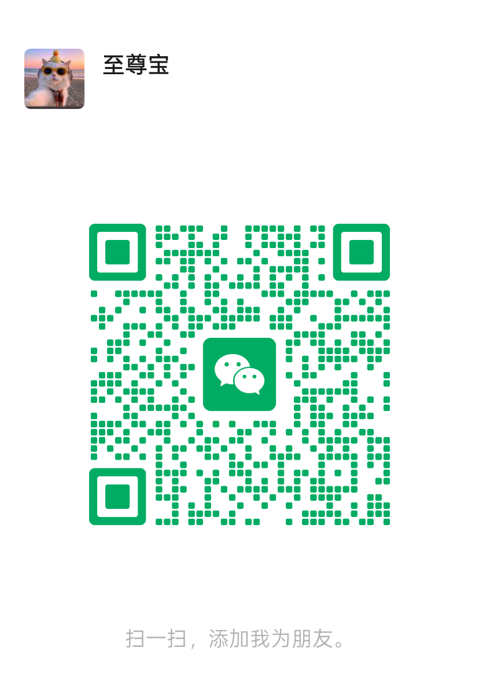
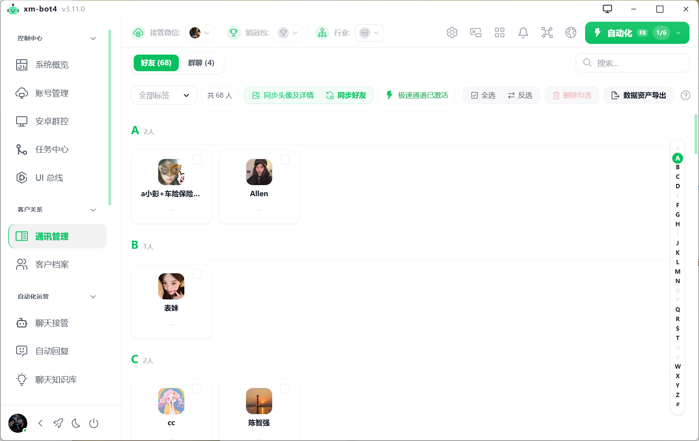

<p align="center">
  
</p>

<h1 align="center">xm-bot4</h1>
<h3 align="center">企业级 PC 微信 Python RPA 自动化客户端与无障碍驱动引擎</h3>

<p align="center">
  <a href="https://www.python.org/"></a>
  <a href="https://www.microsoft.com/windows"></a>
  <a href="#5-开源协议-license"></a>
  <a href="#13-系统架构-architecture"></a>
</p>

---

## 1. 项目介绍 (Introduction)

`xm-bot4` Python RPA 模块是整个 **xm-bot4 智能微信自动化与私域运营系统** 中的 **前端 RPA 执行节点与 PC 微信无障碍驱动引擎**。

> **开源与架构重要声明：**
> 1. 本开源仓库 **仅包含 Python RPA 客户端与 PC 微信 UI 自动化节点的全部源代码**。
> 2. 本开源代码中 **不包含可视化前端界面代码（UI）与核心后端中台代码**。
> 3. 如需获取 **完整前端 UI 界面源码、商业版后端中台源代码或商业授权**，请扫描下方微信二维码联系作者咨询购买：

<p align="center">
  
  <br/>
  <sub><b>商务合作、前端 UI 源码与后端中台购买联系微信</b></sub>
</p>

---

### 1.1 产品功能推荐与概览 (Product Showcase)

<p align="center">
  
  <br/>
  <sub><b>xm-bot4 核心私域运营与自动化功能概览</b></sub>
</p>

---

### 1.2 核心功能与技术特性 (Core Capabilities)

本 Python RPA 引擎专注于提供高性能、高稳定性、防封控的 PC 微信 UI 自动化与 API 交互接口，核心能力体系架构如下：

---

#### PC 微信 UIA 无障碍原生驱动
> **原生级稳定安全防封控驱动引擎**
> - **核心特性**：基于 Windows Native UI Automation 协议实现，零 DLL 注入、零内存 Hook，纯无障碍树元素提取，原生级稳定安全。
> - **应用场景**：微信自动化测试、自动化消息接管、窗口高可靠控制。
> - **搜素关键词**：`微信RPA` `PC微信自动化` `UIAutomation` `无障碍驱动` `微信自动化测试`

---

#### 消息全自动实时监控系统
> **高频未读感知与全类型消息解析**
> - **核心特性**：高频未读消息感知、聊天窗口激活监听。全量支持文本、图片、文件、名片、表情及引用消息防丢包自动解析推流。
> - **应用场景**：实时消息抓取、聊天记录保存、未读消息自动推流。
> - **搜素关键词**：`微信消息监听` `未读消息提取` `聊天记录抓取` `实时推流` `微信消息推送`

---

#### 自动消息回复与推流队列
> **毫秒级安全响应与异步解耦投递**
> - **核心特性**：毫秒级响应自动回复，采用异步解耦消息队列推流。支持超长文本智能分段、剪贴板/模拟按键双通道安全投递与失败重试。
> - **应用场景**：私域客户自动回复、消息批量群发、智能客服挂机。
> - **搜素关键词**：`微信自动回复` `批量发消息` `消息队列` `微信客服机器人` `消息投递`

---

#### 通讯录与全量好友同步导出
> **全量好友检索与增量数据备份**
> - **核心特性**：支持全量微信好友与群聊联系人列表自动化检索，拼音首字母智能排序提取，微信号、备注名、标签与头像增量同步导出。
> - **应用场景**：客户通讯录备份、私域流量资产归档、好友标签同步。
> - **搜素关键词**：`微信联系人导出` `好友列表抓取` `通讯录同步` `私域好友备份` `微信客户管理`

---

#### 微信群自动化与社群运营
> **全功能社群自动化与消息互动**
> - **核心特性**：支持群成员列表自动提取、群公告一键读取、社群消息实时监控、@指定成员精准回复及自动化邀请进群流程。
> - **应用场景**：微信社群自动化管理、群机器人自动拉群、群消息监听。
> - **搜素关键词**：`微信群自动化` `群消息监控` `群成员提取` `微信社群运营` `群机器人`

---

#### DeepSeek / OpenAI 大模型智能人设接管
> **上下文记忆与千人千面 AI 挂机**
> - **核心特性**：原生集成 DeepSeek API 与 OpenAI 兼容协议，内置 Prompt 人设引擎，支持长上下文记忆、千人千面智能客服与无人值守全挂机接管。
> - **应用场景**：智能 AI 客服、微信 AI 聊天机器人、自动销冠助手。
> - **搜素关键词**：`微信AI机器人` `DeepSeek微信接管` `AI自动回复` `智能客服RPA` `大模型接管`

---

#### 多媒体与大文件自动化传输
> **流式传输与图像内容智能分析**
> - **核心特性**：自动化文件附件选择与投递、大文件流式下载归档、聊天图片自动保存、OCR 识别预留与图片内容自动分析。
> - **应用场景**：自动接收归档合同附件、图片内容分析、批量发送文件。
> - **搜素关键词**：`微信文件发送` `图片批量导出` `附件接收` `微信自动化文件` `文件传输`

---

#### 多开独立进程与架构守护
> **进程切断强防杀与无障碍稳定渲染**
> - **核心特性**：彻底切断 Windows Job Object 存活绑定，进程独立存活防强杀；预注入 `QT_ACCESSIBILITY` 确保无障碍树全量高可靠渲染。
> - **应用场景**：多微信同时挂机、后台无人值守运行、防强杀守护。
> - **搜素关键词**：`微信多开管理` `进程独立守护` `QT无障碍注入` `自动化多开` `稳定性保障`

---

#### FastAPI RESTful / WebSocket 高性能 API
> **跨语言解耦封装与标准 JSON 协议**
> - **核心特性**：内置 HTTP/SSE/WebSocket 服务，将底层复杂 UIA 机制解耦封装为标准 JSON API，方便 Rust、Node.js、Go、Java 等语言无缝调用。
> - **应用场景**：二次开发扩展、跨语言调用、微服务架构集成。
> - **搜素关键词**：`微信API接口` `HTTP转微信RPA` `WebSocket推流` `微信二次开发` `RESTful API`

---

### 1.3 系统架构 (Architecture)

```text
+-------------------------------------------------------------------+
|                        微信 PC 客户端 (WeChat)                     |
+-------------------------------------------------------------------+
                                  ^
                                  |  Windows Native UIA (uiautomation)
                                  v
+-------------------------------------------------------------------+
|                 xm-bot4 Python RPA 驱动引擎 (main.py)              |
|  +---------------------+  +-------------------+  +-------------+  |
|  | UIA Driver          |  | Chat Monitor      |  | AI Engine   |  |
|  | (driver/elements)   |  | (chat_monitor.py) |  | (DeepSeek)  |  |
|  +---------------------+  +-------------------+  +-------------+  |
|                                                                   |
|                       FastAPI Server (REST / SSE)                 |
+-------------------------------------------------------------------+
                                  ^
                                  |  HTTP REST / WebSocket (Port 8000)
                                  v
+-------------------------------------------------------------------+
|            外部控制端 / 商业后端中台 (Commercial Backend)           |
+-------------------------------------------------------------------+
```

---

## 2. 前端产品界面展示 (Frontend UI Showcase)

> **重要说明：**
> 本开源 Python RPA 项目仅包含后台自动化驱动逻辑。以下展示的前端 UI 界面属于完整客户端产品。**开源代码中不包含前端 UI 代码，如需购买前端界面源代码或完整桌面应用产品，请联系作者（微信号参见上方二维码）。**

<p align="center">
  
  
</p>

<p align="center">
  
  
</p>

<p align="center">
  
  
</p>

<p align="center">
  
  
</p>

<p align="center">
  
  
</p>

<p align="center">
  
  
</p>

<p align="center">
  
</p>

---

## 3. 部署与环境准备 (Deployment & Setup)

### 3.1 环境要求

- **操作系统**: Windows 10 / Windows 11 (64-bit)
- **Python 版本**: Python 3.10 或 3.11 (推荐 64-bit)
- **客户端版本**: PC 微信 3.9.x / 4.x

### 3.2 安装步骤

1. **克隆本仓库**:
   ```bash
   git clone https://github.com/bbgouzi123/xm-bot4.git
   cd xm-bot4
   ```

2. **创建并激活虚拟环境 (推荐)**:
   ```bash
   python -m venv .venv
   # Windows PowerShell 激活
   .\.venv\Scripts\Activate.ps1
   ```

3. **安装依赖包**:
   ```bash
   pip install -r requirements.txt
   ```

### 3.3 配置文件设置

在根目录下创建 `.env` 文件，用于设置环境变量：

```env
WECHAT_ENHANCED_4X=1
```

如需开启 AI 智能回复功能，请在配置中配置对应的 DeepSeek / OpenAI API Key。

### 3.4 启动方式

- **标准模式 (带 GUI 调试窗口)**:
  ```bash
  python main.py
  ```

- **后台纯服务器模式 (No-GUI Server Mode)**:
  ```bash
  python main.py --no-gui
  ```

启动后，API 服务默认运行在 `http://127.0.0.1:8000`，可通过 Swagger 文档 (`http://127.0.0.1:8000/docs`) 查看所有开放的 RESTful 接口。

---

## 4. 核心技术亮点与稳定性规约 (Technical Guide)

在基于 Windows UIA 机制全自动接管 PC 微信的过程中，本引擎实现了多项核心稳定性规约：

1. **切断终端进程存活绑定 (Job Object)**
   - 弃用 `subprocess.Popen`，采用 `os.startfile(exe_path)` 唤醒微信进程，避免终端关闭或按 `Ctrl+C` 时 Windows Job Object 强杀微信子进程。
2. **避免伪造屏幕阅读器标志 (SPI_SETSCREENREADER)**
   - 避免直接发送 `SystemParametersInfoW` 欺骗 Qt 开启无障碍带来的无障碍树残缺与崩溃，通过环境变量注入 `QT_ACCESSIBILITY=1` 实现无损无障碍树建立。
3. **冷启动 15 秒宽容度逻辑**
   - 优化冷启动登录后 Qt 组件树建树时间差，无障碍提取管家将核心导航栏检测超时提升至 15 秒，抹平自动化启动延时。
4. **头像及资源增量缓存机制**
   - 本地缓存头像比对跳过物理点击提取（`skip_avatar_if_exists=True`），极大地提升了启动与联系人同步速度。

---

## 5. 开源协议 (License)

### License Terms (English Specification)

```text
Reciprocal Open Source License Notice & Attribution Agreement

Copyright (c) xm-bot4 Open Source Contributors.

Permission is hereby granted, free of charge, to any person obtaining a copy
of this software and associated documentation files (the "Software"), to deal
in the Software without restriction, including without limitation the rights
to use, copy, modify, merge, publish, distribute, sublicense, and/or sell
copies of the Software, subject to the following MANDATORY CONDITIONS:

1. RECIPROCAL OPEN-SOURCE OBLIGATION:
   Any project, software product, secondary derivative work, or service 
   incubated, derived, or built using this source code (or any portion thereof)
   MUST BE FULLY OPEN-SOURCED under licensing terms no less restrictive 
   than this license. Closed-source commercial repackaging of this RPA node 
   without explicit written authorization is strictly prohibited.

2. MANDATORY ATTRIBUTION & ORIGINAL REFERENCE:
   Any derivative work, redistribution, or published application must retain 
   and clearly display this original copyright notice and explicitly cite 
   attribution referencing the original project repository URL:
   https://github.com/bbgouzi123/xm-bot4

3. COMMERCIAL BACKEND & PROPRIETARY LICENSE NOTICE:
   This repository contains ONLY the Python RPA node client code. The core 
   management platform, multi-instance control center, enterprise backend, 
   and frontend UI source code are proprietary commercial software. 
   For commercial licensing, enterprise backend/frontend source code purchase, 
   or custom development, please contact the author via WeChat (as shown in image.png).

THE SOFTWARE IS PROVIDED "AS IS", WITHOUT WARRANTY OF ANY KIND, EXPRESS OR
IMPLIED, INCLUDING BUT NOT LIMITED TO THE WARRANTIES OF MERCHANTABILITY,
FITNESS FOR A PARTICULAR PURPOSE AND NONINFRINGEMENT.
```
